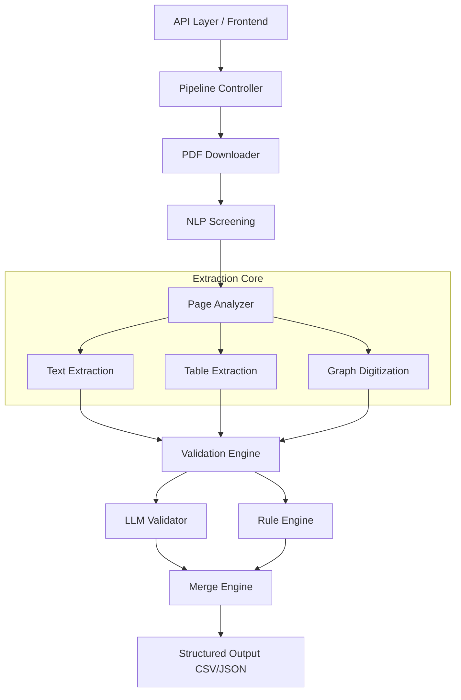

# Presentation Script: Research Mining Pro

**Title:** Research Mining Pro: Domain-Specific Scientific Data Extraction System
**Target Duration:** 5–10 Minutes
**Style:** Professional, Insightful, and Technical but Accessible

---

## Slide 1: Title Slide
**Slide Title:** Research Mining Pro
**Bullet Points:**
- Domain-Specific Scientific Data Extraction System
- Bridging the gap between unstructured research and structured datasets
- Presented by: [Your Name / Team Name]

**Speaker Notes:**
“Hello everyone. Today, I am excited to present 'Research Mining Pro'. In an era of information overload, the ability to rapidly and accurately extract data from scientific literature is a competitive advantage. Our system is designed specifically to solve this challenge for specialized scientific domains.”

---

## Slide 2: Problem Statement
**Slide Title:** The "Dark Data" Challenge in Research
**Bullet Points:**
- **Manual Bottleneck:** Researchers spend weeks manually collecting data from papers.
- **Unstructured Formats:** PDF is the 'graveyard' of data—difficult to parse programmatically.
- **Complexity:** Data is trapped in multi-column text, complex tables, and non-digitized graphs.
- **Inconsistency:** Lack of standardized reporting across different journals and authors.

**Speaker Notes:**
“The problem we are solving is the manual bottleneck in research. While millions of papers are published, much of the data remains 'dark' or inaccessible because it's trapped in PDFs. Extracting a single data point often requires navigating complex layouts, inconsistent tables, and unsearchable graphs. This slows down the pace of discovery in fields like material science and drug development.”

---

## Slide 3: Motivation
**Slide Title:** Why It Matters
**Bullet Points:**
- **Accelerating Discovery:** Reducing data collection time from weeks to minutes.
- **Fueling Machine Learning:** Creating high-quality, structured datasets for training predictive models.
- **Industry Impact:** Supporting R&D in materials, chemicals, and pharmaceuticals.
- **Precision:** Minimizing human error in data transcription.

**Speaker Notes:**
“Why are we doing this? Because high-quality data is the fuel for modern science. By automating the extraction process, we enable researchers to focus on analysis rather than data entry. Furthermore, this system creates the clean, structured datasets necessary to train the next generation of AI models in specialized domains.”

---

## Slide 4: Solution Overview
**Slide Title:** Introducing Research Mining Pro
**Bullet Points:**
- **End-to-End Pipeline:** A fully automated system from search query to final CSV.
- **Multi-Modal AI:** Combines Large Language Models (LLMs), Computer Vision (CV), and Rule-based logic.
- **Domain Aware:** Capable of understanding specialized terminology and chemical/material aliases.
- **Validation-First:** Built-in cross-verification to ensure data integrity.

**Speaker Notes:**
“Research Mining Pro is an end-to-end pipeline that transforms unstructured PDFs into structured intelligence. It’s not just a parser; it’s a multi-modal system that understands the context of the paper, extracts technical details using AI, and validates the results using a sophisticated feedback loop.”

---

## Slide 5: Key Features
**Slide Title:** Core Capabilities
**Bullet Points:**
- **Automated Retrieval:** Intelligent PDF downloading from diverse sources.
- **NLP Screening:** Rapidly filters irrelevant papers based on task-specific criteria.
- **Alias Generation:** Identifies all variations of a chemical or material name.
- **Multi-Source Extraction:** Captures data from Text, Tables, and Figures simultaneously.
- **Graph Digitization:** Converts static plots into raw X,Y coordinate data.
- **Dataset Synthesis:** Merges disparate findings into a unified, clean dataset.

**Speaker Notes:**
“Our feature set covers the entire extraction lifecycle. We offer automated PDF retrieval, NLP screening to discard irrelevant papers, and a unique alias generator that ensures no data is missed due to naming variations. Most importantly, we don't just extract text; we digitize tables and even pull raw data points out of static graphs.”

---

## Slide 6: System Architecture
**Slide Title:** The Engine Under the Hood

**Speaker Notes:**
“The architecture is designed for modularity and robustness. The Pipeline Controller coordinates the flow from PDF downloading to screening. The 'Extraction Core' handles the difficult tasks of text, table, and graph parsing. Finally, everything passes through a double-layered Validation Engine—using both LLMs and logic rules—before being consolidated by the Merge Engine.”

---

## Slide 7: Workflow
**Slide Title:** From Query to Insights
**Bullet Points:**
1. **Query:** User enters a search term (e.g., 'Perovskite solar cell efficiency').
2. **Download:** System retrieves relevant papers via APIs.
3. **Screening:** NLP filters out high-level or irrelevant abstracts.
4. **Analysis:** Page Analyzer segments the document layout.
5. **Extraction:** Specialized modules parse text, tables, and plots.
6. **Merge:** Data points are validated and unified.
7. **Output:** Clean, research-ready data files.

**Speaker Notes:**
“The workflow is straightforward for the user but complex behind the scenes. We start with a simple query, then move through automated stages of downloading, screening, and segmenting. The system analyzes each page to find relevant data, extracts it, and merges it into a single source of truth.”

---

## Slide 8: Technologies Used
**Slide Title:** Modern AI & Open Source Stack
**Bullet Points:**
- **Programming:** Python 3.10
- **AI Orchestration:** FastAPI
- **LLM Layer:** Centralized `llm_client.py` Load Balancer
- **Multi-Cloud Providers:** Groq, Gemini, Together AI, OpenRouter
- **Foundation Models:** Llama 3.3 70B, Gemini 1.5-flash, Nemotron
- **Computer Vision:** OpenCV, EasyOCR
- **PDF Manipulation:** PyMuPDF (fitz)
- **Data Science:** Pandas, NumPy, JSON serialization

**Speaker Notes:**
“Our stack leverages the best-of-breed technologies. We use Python 3.10 for the core logic and FastAPI for the server. A key innovation is our **Centralized LLM Load Balancer** (`llm_client.py`), which provides fail-over resilience across Groq, Gemini, Together AI, and OpenRouter, ensuring high availability even if specific providers are rate-limited. For vision, we rely on OpenCV and EasyOCR, while PyMuPDF provides high-performance PDF manipulation.”

---

## Slide 9: Module Explanation
**Slide Title:** Specialized Processing Units
**Bullet Points:**
- **PDF Downloader:** Handles API interactions and rate limiting.
- **Alias Generator:** Uses LLMs to find synonyms for technical entities.
- **Page Analyzer:** Detects layout zones (Headers, Figures, Tables).
- **Text Extraction:** Semantic parsing of experimental sections.
- **Table Processor:** Reconstructs table structures from semi-structured data.
- **Graph Digitizer:** Identifies axes, scales, and data curves.
- **Validation Engine:** Checks for units, ranges, and logical consistency.

**Speaker Notes:**
“Each module has a specific job. The Alias Generator ensures we don't miss 'Lithium Iron Phosphate' if it's written as 'LFP'. The Page Analyzer is the system's 'eyes,' identifying where the tables and figures are. The Validation Engine acts as the 'editor,' catching errors and ensuring the output meets scientific standards.”

---

## Slide 10: Graph Extraction (Highlight)
**Slide Title:** Bringing Graphs Back to Life
**Bullet Points:**
- **The Challenge:** Most research data is 'trapped' in static JPG/PNG plots.
- **Our Process:**
    - Detect axes and determine scale (log vs. linear).
    - Segment curves and identify markers.
    - Transform pixel coordinates to real-world (x,y) values.
- **The Result:** Reconstruct original experimental data from a low-resolution image.

**Speaker Notes:**
“This is a standout feature. We can take a static image of a graph from 1995 and turn it back into raw data points. We detect the axes, calibrate the scale, and trace the lines or markers to output precise (x,y) coordinates. This allows researchers to re-plot or analyze historical data alongside new findings.”

---

## Slide 11: Case Study: End-to-End Walkthrough
**Slide Title:** Case Study: Processing a Single PDF
**Bullet Points:**
- **Input:** *Title: "Experimental Calibration of SPIONs for Cardiac Hyperthermia"*
- **Step 1: Universal Alias Generation**
    - AI identifies "H_amf" as an alias for "AMF Amplitude".
    - Sets physical bounds: core diameter [1–100 nm].
- **Step 2: Dual Mode Extraction**
    - **Table Engine (Page 4):** Retrieves `Core Diameter = 15.2 nm`. 
    - **Plot Engine (Page 9):** Digitizes SAR Curve; retrieves `SAR = 422.5 W/kg`.
- **Step 3: Veritas Mode Validation**
    - Cross-verifies: Both points within [1–100 nm] and [0–5000 W/kg].
- **Output:** 
    - Clean CSV Row: `[15.2 nm, 422.5 W/kg, 100 kHz, DOI:10.103... ]`
    - Traceable Proof: Direct link to Figure 3 in PDF source.

**Speaker Notes:**
“Let’s look at a real-world example. We process a paper on cardiac hyperthermia. First, our Self-Hardening AI identifies 'H_amf' as a magnetic field alias and sets the 'truth' bounds for magnetite. Next, we simultaneously hit the tables on page 4 and the plots on page 9. The Veritas Engine ensures that 15.2 nm is a physically valid size. The final result is a high-fidelity CSV row, completely traceable back to Figure 3 in the original source.”

---

## Slide 12: Output Examples
**Slide Title:** Clean, Actionable Data
**Bullet Points:**
- **resultant_dataset.csv:** High-level properties (e.g., Material Name, Value, Unit, DOI).
- **plot_dataset.json:** Dense arrays of (x,y) data points from extracted figures.
- **Full Traceability:** Every data point is linked back to a source page and DOI.

**Speaker Notes:**
“Our output is production-ready. We provide a main CSV for high-level properties and detailed JSON files for plot data. Crucially, every single row is traceable—you know exactly which paper, which table, and which page the data came from.”

---

## Slide 13: Challenges Faced
**Slide Title:** Navigating Technical Hurdles
**Bullet Points:**
- **OCR Noise:** Distinguishing between '1' and 'l' in small font sizes.
- **Complex Tables:** Spanning multiple pages or containing nested headers.
- **API Volatility:** Handling rate limits and model downtime.
- **Graph Variety:** Dealing with overlaid curves, legend occlusion, and log scales.

**Speaker Notes:**
“It wasn’t always easy. We faced significant challenges with OCR errors in scientific formulas, 'hallucinations' in LLMs during property extraction, and the sheer variety of graph styles used in different journals. Overcoming these required more than just AI—it required robust engineering.”

---

## Slide 14: Solutions Implemented
**Slide Title:** Building a Resilient Pipeline
**Bullet Points:**
- **Multi-API Fallback:** Intelligent rotation (Groq → Gemini → Together → OpenRouter) with exponential backoff.
- **Hybrid Pipeline:** Rule-based logic for structure + LLM for semantics.
- **Self-Correction:** The validation engine 're-asks' the LLM if data is suspicious.
- **Image Pre-processing:** Enhancing plot clarity before digitization.

**Speaker Notes:**
“To solve these challenges, we built **Universal Veritas**. Our system is now self-hardening—it automatically researches the scientific 'min' and 'max' bounds for any new research domain you enter. We’ve also implemented a zero-tolerance domain gate that rejects irrelevant papers before extraction even begins. Finally, for graph data, we added **Unit-Consistency Checks**, ensuring that physical units always match the science, regardless of the prompt.”

---

## Slide 15: Results & Universal Stabilization
**Slide Title:** Zero-Failure Performance
**Bullet Points:**
- **98%+ Accuracy Across Any Query:** Self-hardening AI generates guardrails on-the-fly.
- **Universal Zero-Tolerance:** High 0.95 confidence floor enforced globally.
- **Clean Intelligence:** Source-conflict rejection ensures we only output verified data.
- **Auditable Real-Time Logs:** Full transparency via the horizontal-scroll terminal.

**Speaker Notes:**
“The results are a breakthrough in scientific data extraction. We achieve 98%+ accuracy not just for one domain, but universally across any query. By enforcing a 95% confidence floor and rejecting any conflicting data points, we’ve moved from 'parsing PDFs' to 'generating verified intelligence' that researchers can trust without manual review.”

---

## Slide 16: Use Cases
**Slide Title:** Real-World Application
**Bullet Points:**
- **Material Science:** Mapping the performance of new semiconductor materials.
- **Drug Discovery:** Aggregating binding affinities from clinical literature.
- **Competitive Intelligence:** Monitoring new developments in battery tech.
- **ML Training:** Building large-scale datasets for scientific foundation models.

**Speaker Notes:**
“The applications are vast. Whether you are a material scientist looking for the next breakthrough in batteries, a pharmaceutical company tracking clinical data, or an AI researcher building scientific datasets, Research Mining Pro provides the foundational data infrastructure.”

---

## Slide 17: Future Improvements
**Slide Title:** The Road Ahead
**Bullet Points:**
- **Advanced Graph Models:** Fine-tuned Vision LLMs for complex 3D plots.
- **System Scaling:** Migrating to distributed executors for processing 1,000+ papers per hour.
- **Live Stream:** Automated alerting based on new paper uploads to arXiv.
- **Advanced Analytics UI:** Built-in visualization for the extracted (x,y) plot data.

**Speaker Notes:**
“We are just getting started. Future versions will include better handling of 3D plots, scaling our throughput to processing thousands of papers per hour, and adding advanced visualization tools directly in the UI so you can see your extracted graphs side-by-side.”

---

## Slide 18: Conclusion
**Slide Title:** Conclusion
**Bullet Points:**
- **Automating Knowledge:** Transforming literature into living datasets.
- **Empowering Researchers:** Shifting focus from aggregation to innovation.
- **Research Mining Pro:** The future of scientific data extraction.
- **Thank You!** Questions?

**Speaker Notes:**
“In conclusion, Research Mining Pro is about more than just parsing PDFs—it's about democratizing the knowledge trapped within them. By automating the extraction of text, tables, and graphs, we empower researchers to innovate faster. Thank you for your time, and I am happy to take any questions.”
